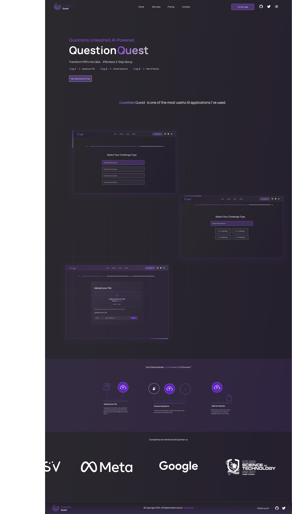

# Question Quest - Your Personalized Exam Practice Companion

Question Quest is your ultimate solution for targeted exam preparation. Whether you're a university student gearing up for finals, a professional seeking to enhance your skills, or anyone in need of structured practice, Question Quest has you covered.

## Key Features:

- **Customized Practice Questions**: Upload your study materials in PDF format, and Question Quest's advanced Generative AI technology will craft practice questions tailored to your specific needs.

- **Practice Your Way**: Customize your practice sessions by selecting preferred question types, and amount.

- **Instant Feedback**: after you have uploaded your pdf you will get a questiion list with the answer key provided at the end in the form of pdf.

- **Detailed Explanations**: Access detailed explanations on the answer key to get what you are lacking and not lacking.

- **Accessible to All**: Whether you're a student striving for academic success or a lifelong learner on a quest for knowledge, Question Quest is your ideal practice partner.

Question Quest is more than just a study aid; it's your personalized exam practice companion. Harness the power of AI to supercharge your exam preparation, improve your confidence, and excel in your assessments.

Join the quest for excellence with Question Quest today!

---

This revised description emphasizes the personalized exam practice aspect of Question Quest, making it clear that the platform is tailored to individuals who need targeted practice to excel in their exams or assessments.

## Table of Contents

- [Demo](#demo)
- [Design](#design)
- [Getting Started](#getting-started)
- [Team Members](#team-members)

## Demo

You can view a live demo of the project [here](#) (if available).



## Design

We have designed the project using Figma. You can access the design by clicking on the link below:

[Figma Design](https://www.figma.com/file/7VMb6yi4p277KgJFHssKu4/A2SV-Generative-AI--PDF-TO-Question?type=design&node-id=148%3A2&mode=design&t=AY4GycaAjGAk7qwP-1)

## Getting Started

Follow these steps to get the project up and running on your local machine.

### Prerequisites

Make sure you have the following installed:

- [Node.js](https://nodejs.org/)
- [npm](https://www.npmjs.com/) (usually comes with Node.js)

### Installation

1. Clone the repository:

   ```bash
   git clone https://github.com/DagNo1/Question-Quest.git
   ```

2. Navigate to the project directory:

   ```bash
   cd Question-Quest
   ```

3. Install project dependencies:

   ```bash
   npm install | npm i
   ```

4. Start the development server:

   ```bash
   npm run dev
   ```

5. Open your browser and navigate to `http://localhost:5173` to view the project.

### Build for Production

To build the project for production, run:

```bash
npm run build
```

### Customize TailwindCSS

This project is configured with TailwindCSS. You can customize the styles by editing the `tailwind.config.js` file.

## Team Members

- Dagim Tesfaye ([GitHub](https://github.com/DagNo1))
- Abel Shibabaw ([GitHub](https://github.com/abel-cosmic))
- Mohammed Ibrahim ([GitHub](https://github.com/MohammedIbrahim8887))
- Jonathan Zeru ([GitHub](https://github.com/JonathanZeru))
- Wengel Tesema ([GitHub](https://github.com/wengel7))

## Contributing

If you'd like to contribute to this project, please read the [Contributing Guidelines](CONTRIBUTING.md).

## License

This project is licensed under the [MIT License](LICENSE).
